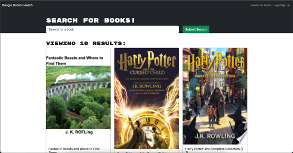

# Book Search Engine (MERN Stack)

## Project Description

In the realm of modern web development, data personalization and responsiveness to user demands stand as pivotal factors in crafting exceptional user experiences. This project encapsulates these core principles by presenting a challenge that involves the transformation of a Google Books API search engine. Originally developed with a RESTful API and housed within the MERN (MongoDB, Express.js, React, Node.js) stack, the objective is to refactor this application into a GraphQL API utilizing Apollo Server. This evolution will not only enhance performance but also enable seamless data retrieval and manipulation based on user interactions.

### Project Screenshot

## Tech Stacked
GraphQL
Apollo Server
MERN Stack (MongoDB, Express.js, React, Node.js)
Authentication Middleware

### Conclusion

This project encapsulates the spirit of modern web development by transforming a RESTful API-powered search engine into an innovative GraphQL-driven application.

### Contact
Mackenzie Lukic
https://github.com/mlukicdesign